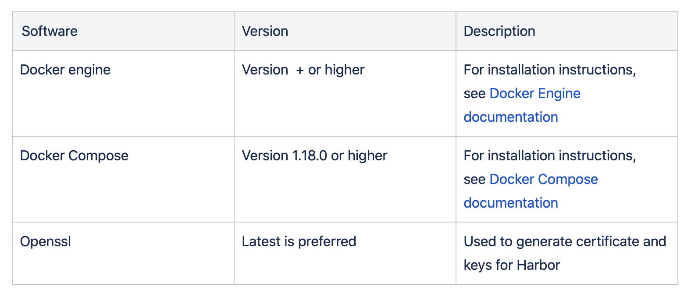

#Harbor Registry


Below Steps are for creating a harbor registry hosted on AWS EC2 instance.

- [Harbor Installation Prerequisites](#harbor-installation-prerequisites)
  - [Hardware Prerequisites](#hardware-prerequisites)
    - [1. EC2 Instance](#1-ec2-instance)
  - [Software Prerequisites](#software-prerequisites)
    - [1. Docker ( Version 17.06.0-ce+ or higher )](#1-docker--version-17060-ce-or-higher-)
    - [2. Docker Compose ( Version 1.18.0 or higher )](#2-docker-compose--version-1180-or-higher-)
    - [3. Domain Mapping](#3-domain-mapping)
- [Download the Harbor Installer](#download-the-harbor-installer)
- [Generate certificate and keys](#generate-certificate-and-keys)
- [Configuring Harbor Application](#configuring-harbor-application)
- [Install Harbor](#install-harbor)

# Harbor Installation Prerequisites

ref: [Link](https://goharbor.io/docs/2.1.0/install-config/installation-prereqs/)

## Hardware Prerequisites

### 1. EC2 Instance

Create an EC2 Instance with below Hardware steps


Enable below mentioned ports in Security Group attached to Ec2


## Software Prerequisites

The following table lists the software versions that must be installed on the target host.



### 1. Docker ( Version 17.06.0-ce+ or higher )

ref : [https://docs.docker.com/engine/install/ubuntu/](https://docs.docker.com/engine/install/ubuntu/)

1. Set up The Docker Repository
Update the `apt` package index

    ```
    sudo apt-get update
    ```

    Install packages to allow `apt` to use a repository over HTTPS:

    ```
    sudo apt-get install \ apt-transport-https \ ca-certificates \ curl \ gnupg-agent \ software-properties-common
    ```

2. Add Docker’s official GPG key:

    ```
    curl -fsSL https://download.docker.com/linux/ubuntu/gpg | sudo apt-key add -
    ```

3. Use the following command to set up the **stable** repository. ( for x86_64/amd64)

    ```
    sudo add-apt-repository \ "deb [arch=amd64] https://download.docker.com/linux/ubuntu \ $(lsb_release -cs) \ stable"
    ```

4. Install Docker Engine

    ```
    sudo apt-get update
    sudo apt-get install docker-ce docker-ce-cli containerd.io
    ```

5. Add your user to the docker group

    ```
    sudo usermod -aG docker ${USER}
    ```

6. Log out and log in to EC2 Instance and try out a docker command to very docker is installed properly

    ```
    docker --version
    Docker version 19.03.13, build 4484c46d9d
    ```

### 2. Docker Compose ( Version 1.18.0 or higher )

ref : [https://docs.docker.com/compose/install/](https://docs.docker.com/compose/install/)

1. Run this command to download the current stable release of Docker Compose:

    ```
    sudo curl -L \
    "https://github.com/docker/compose/releases/download/1.27.4/docker-compose-$(uname -s)-$(uname -m)" \
    -o /usr/local/bin/docker-compose
    ```

2. Apply executable permissions to the binary:

    ```
    sudo chmod +x /usr/local/bin/docker-compose
    ```

3. Test the Docker-Compose version

    ```
    docker-compose --version
    docker-compose version 1.27.4, build 40524192
    ```

### 3. Domain Mapping

1. Stop and Disable Apache on Ubuntu

    ```
    sudo systemctl stop apache2
    sudo systemctl disable apache2
    ```

2. Install Nginx ( This Nginx is **NOT** needed for harbor. Ngnix container is already included in harbor installation via docker-compose. This is just to test the domain and completely optional step )

    ```
    sudo apt-get install nginx
    ```

3. Start and enable NGINX with the commands:

    ```
    sudo systemctl start nginx
    sudo systemctl enable nginx
    sudo systemctl status nginx
    ``nginx`

4. Get the public ip of the EC2 instance and map it to a domain

for e.g.,

if you have a registered domain [www.example.com](http://www.mydomain.com/) with you , map that domain to EC2 Instance IP by adding Resource Records (Ref: Link [here](https://support.google.com/domains/answer/3251147?authuser=1&hl=en%20) for Google Domains)

If properly configured, [www.example.com](http://www.example.com/) will display nginx server page as below


# Download the Harbor Installer

1. Download Harbor offline-installer from official release page

    ```
    wget https://github.com/goharbor/harbor/releases/download/v2.1.1/harbor-offline-installer-v2.1.1.tgz
    ```

2. Optionally download the corresponding `.asc` file to verify that the package is genuine.

    ```
    wget https://github.com/goharbor/harbor/releases/download/v2.1.1/harbor-offline-installer-v2.1.1.tgz.asc
    ```

3. Verify that the package is genuine by running the following command.

    ```
    gpg -v --keyserver hkps://keyserver.ubuntu.com --verify harbor-offline-installer-v2.1.1.tgz.asc
    ```

    Output:

    ```
    gpg: assuming signed data in 'harbor-offline-installer-v2.1.1.tgz'
    gpg: Signature made Fri Oct 23 03:59:38 2020 UTC
    gpg: using RSA key 7722D168DAEC457806C96FF9644FF454C0B4115C
    gpg: using pgp trust model
    gpg: Good signature from "Harbor-sign (The key for signing Harbor build) <jiangd@vmware.com>" [unknown]
    gpg: WARNING: This key is not certified with a trusted signature!
    gpg: There is no indication that the signature belongs to the owner.
    Primary key fingerprint: 7722 D168 DAEC 4578 06C9 6FF9 644F F454 C0B4 115C
    gpg: binary signature, digest algorithm SHA512, key algorithm rsa4096
    ```

4. Extract the Harbor files

    ```
    tar zxvf harbor-offline-installer-v2.1.1.tgz
    ``letse`

# Generate certificate and keys

Ref : [https://www.digitalocean.com/community/tutorials/how-to-use-certbot-standalone-mode-to-retrieve-let-s-encrypt-ssl-certificates-on-ubuntu-1804](https://www.digitalocean.com/community/tutorials/how-to-use-certbot-standalone-mode-to-retrieve-let-s-encrypt-ssl-certificates-on-ubuntu-1804)

To enable HTTPS on your website, you need to get a certificate (a type of file) from a Certificate Authority (CA). We will be using Let’s Encrypt to generate our certificates with the use of [Certbot](https://certbot.eff.org/) ACME client. Certbot can automate certificate issuance and installation with no downtime.


1. Installing Certbot

    ```
    sudo add-apt-repository ppa:certbot/certbot
    ```

2. Update the package list to pick up the new repository’s package information:

    ```
    sudo apt update
    ```

3. install the `certbot` package:

    ```
    sudo apt install certbot
    ```

4. Open up the appropriate port in your firewall:

    ```
    sudo ufw allow 80
    ```

5. Run Certbot to get our certificate`-standalone` = tell Certbot to handle the challenge using its own built-in web server. `-preferred-challenges http` = option instructs Certbot to use port 80`d` flag is used to specify the domain you’re requesting a certificate for.

    ```
    sudo certbot certonly --standalone --preferred-challenges http -d example.com
    ```

6. If Successful, similar message will be displayed as the output

    ````
    IMPORTANT NOTES: - Congratulations! Your certificate and chain have been saved at: /etc/letsencrypt/live/example.com/fullchain.pem Your key file has been saved at: /etc/letsencrypt/live/example.com/privkey.pem Your cert will expire on 2021-02-11. To obtain a new or tweaked version of this certificate in the future, simply run certbot again. To non-interactively renew *all* of your certificates, run "certbot renew" - If you like Certbot, please consider supporting our work by: Donating to ISRG / Let's Encrypt: https://letsencrypt.org/donate Donating to EFF: https://eff.org/donate-le
    ```

7. List the keys generated and verify

    ```
    sudo ls /etc/letsencrypt/live/example.com
    ```

    `privkey.pem` :
    This is the private key for the certificate. This needs to be kept safe and secret, which is why most of the `/etc/letsencrypt` directory has very restrictive permissions and is accessible by only the **root** user. Most software configuration will refer to this as something similar to `ssl-certificate-key` or `ssl-certificate-key-file`.
    
    `fullchain.pem`:
    This is our certificate, bundled with all intermediate certificates. Most software will use this file for the actual certificate, and will refer to it in their configuration with a name like ‘ssl-certificate’.
    
    `chain.pem` : used for OCSP stapling in Nginx >=1.3.7.
    
    `cert.pem` : 

# Configuring Harbor Application

1. `cd harbor
cp harbor.yml.tmpl harbor.yml`

    Edit harbor.yml

    ```
    sudo nano harbor.yml
    ```

2. hostname: [example.com](http://example.com/)
    1. certificate: /etc/letsencrypt/live/example.com/fullchain.pem
    2. private_key: /etc/letsencrypt/live/example.com/privkey.pem

# Install Harbor
1. Run the below script in /harbor folder
   ```
   sudo ./install.sh
   ```

    Successful Output:

    ```
    [Step 5]: starting Harbor ...
    Creating network "harbor_harbor" with the default driver
    Creating harbor-log ... done
    Creating harbor-db ... done
    Creating harbor-portal ... done
    Creating redis ... done
    Creating registry ... done
    Creating registryctl ... done
    Creating harbor-core ... done
    Creating harbor-jobservice ... done
    Creating nginx ... done
    ✔ ----Harbor has been installed and started successfully.----
    ```

2. Login to Harbor by browsing to [example.com](http://example.com/)

    

